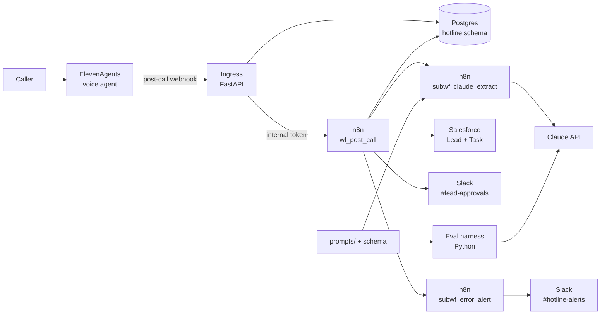
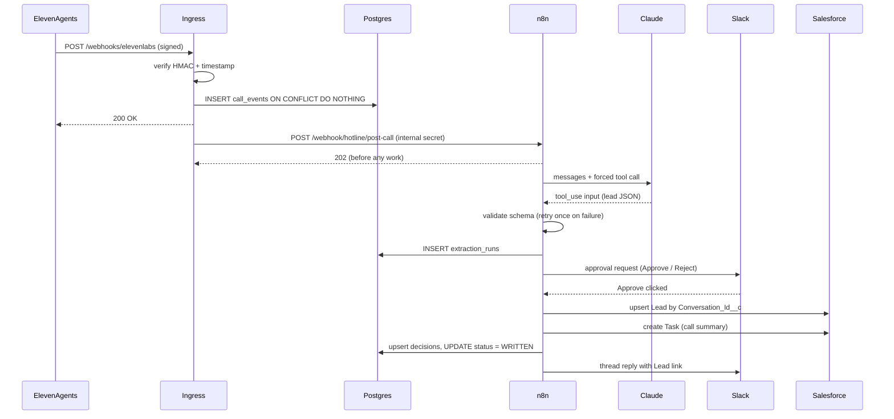
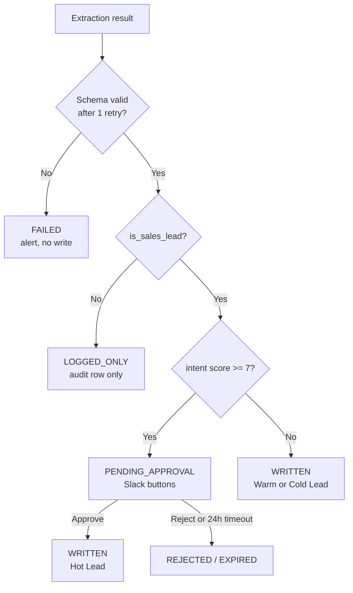
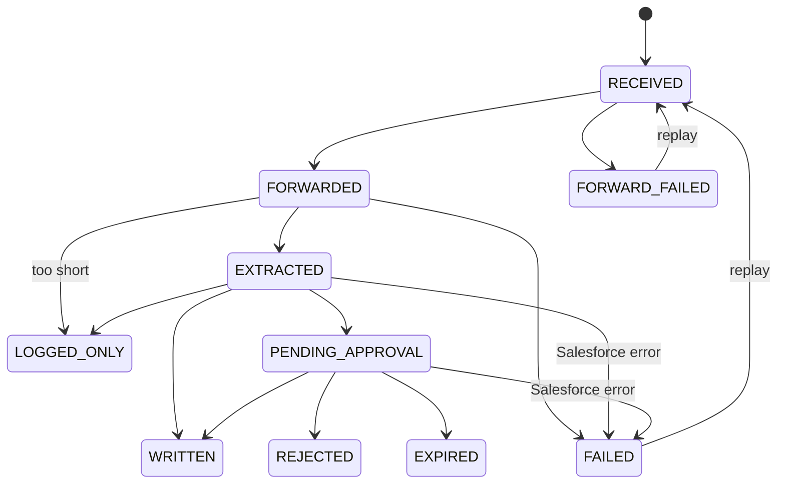

# Hotline architecture

These diagrams come from the PRD (`VoiceHub Lead Desk — PRD.pdf`, sections 4
and 5). They are updated where the tech-lead amendments in
[`contracts.md`](contracts.md) change the design. The binding interfaces
(payloads, schema, request shape, routing) are in `contracts.md`. This page
explains how the pieces fit together.

The ingress owns trust and durability. n8n owns business logic. Claude only
extracts data and never writes to anything.

## 1. System overview (PRD §4)

A call moves from left to right. n8n and the eval harness read the same prompt
and schema files, so the eval tests exactly what runs in production. That
includes `prompts/model_params.json` (Amendment 1).

### Components

| Component | Responsibility | Does not do | Code |
|---|---|---|---|
| ElevenAgents agent | Holds the qualifying conversation and sends the post-call webhook | Decide anything about the lead | `agent/agent_prompt.md` |
| Ingress (FastAPI) | Verifies the HMAC and timestamp, checks the agent allowlist, dedupes on `conversation_id`, stores the raw event, replies 200 quickly, forwards to n8n, and replays failed forwards | Call Claude or Salesforce | `ingress/app/` |
| `wf_post_call` (n8n) | Normalizes the call, calls the extractor, applies the routing policy, writes to Salesforce, asks for approval, and writes audit rows | Hold secrets in node config (it uses n8n credentials) | `n8n/workflows/wf_post_call.json` |
| `subwf_claude_extract` (n8n) | Reusable: takes a prompt folder and a transcript and returns validated JSON, with one retry that feeds back the validation errors | Know anything about sales | `n8n/workflows/subwf_claude_extract.json` |
| `subwf_error_alert` (n8n) | Formats failures and posts them to Slack with a link to the execution | Retry business logic | `n8n/workflows/subwf_error_alert.json` |
| Postgres `hotline` schema | Stores events, the extraction audit, and decisions | Replace Salesforce as the system of record | `db/001_init.sql`, `db/queries.sql` |
| Eval harness | Scores prompt versions and models against labeled transcripts | Run in the live path | `eval/` |

## 2. Happy path: hot lead with approval (PRD §5.1)

The webhook is acknowledged before any AI or CRM work starts. For a hot lead,
the Salesforce write happens only after a human approves. The explicit `202`
line is new compared with the PRD. Because n8n replies before the ingress
records `FORWARDED`, n8n's first status update also accepts `RECEIVED`
(Amendment 2).

## 3. Routing decision (PRD §5.2)

| Score | Salesforce `Rating` | Path |
|---|---|---|
| 7–10 | Hot | Approval required |
| 4–6 | Warm | Auto-write |
| 1–3 | Cold | Auto-write |

The thresholds live in the `Config` Set node of `wf_post_call`
(`INTENT_APPROVAL_THRESHOLD = 7`, `MIN_USER_TURNS = 2`). `eval/scoring.py`
derives routes with the same rule, and `eval/config.py` holds the same
constants. A call with fewer than `MIN_USER_TURNS` caller turns goes to
`LOGGED_ONLY` before Claude is called.

## 4. Call record state machine: `call_events.status` (PRD §5.3, amended)

Changes from the PRD diagram:

- **Replay claims the row back to `RECEIVED`** (Amendment 2). The PRD's
  `FORWARD_FAILED --> FORWARDED` edge is replaced. `POST /admin/replay/{id}`
  first runs a guarded `FORWARD_FAILED|FAILED -> RECEIVED`. If that updates 0
  rows, the endpoint returns 409, so two concurrent replays can't both run.
  Then it forwards normally (`RECEIVED -> FORWARDED | FORWARD_FAILED`). A row
  left in `RECEIVED` for more than 5 minutes (the ingress died before its
  background forward) can also be claimed.
- **n8n's first transition accepts `RECEIVED` or `FORWARDED`.** This covers
  `EXTRACTED`, `FAILED` (extraction), and `LOGGED_ONLY` (too short). n8n
  replies 202 before the ingress records `FORWARDED`, so n8n can reach this
  update while the row is still `RECEIVED`. When that happens, the ingress's
  own `RECEIVED -> FORWARDED` update matches 0 rows, and the call goes
  straight from `RECEIVED` to the n8n state. The diagram shows only the
  `FORWARDED` edges to stay readable.
- **Salesforce failures.** A Salesforce 4xx, or a 5xx after 2 retries, moves
  the call from `EXTRACTED` (auto-write) or `PENDING_APPROVAL` (after Approve)
  to `FAILED`, with `last_error = "<node>: <message>"`.
- **Too short.** Fewer than `MIN_USER_TURNS` caller turns goes to
  `LOGGED_ONLY` directly, without passing through `EXTRACTED`.

Every transition is a single
`UPDATE hotline.call_events SET status=$new, updated_at=now() WHERE conversation_id=$id AND status=$expected`.
If it updates 0 rows, another run already moved the call, so this run stops.
A replay runs the n8n workflow again, so every n8n write is idempotent:

- `decisions` is upserted on `conversation_id`.
- The Lead is upserted on `Conversation_Id__c`.
- The Task is skipped when `decisions.sf_task_id` is already set.

## 5. Contract amendments

These are deliberate changes from the PRD, made by the tech lead. The full
text is in [`contracts.md`](contracts.md).

| # | Change | Why | Where |
|---|---|---|---|
| [Amendment 1](contracts.md#claude-request-shape-shared-by-n8n-code-node-and-evalrequestpy) | `temperature` is no longer a fixed key. The request builder merges a per-model profile from `prompts/model_params.json` (`claude-sonnet-5`: `thinking: {type: disabled}`; Haiku 4.5: `temperature: 0`). If the response has `stop_reason == "max_tokens"` or no `tool_use` block, the output is invalid and triggers the one retry | `claude-sonnet-5` rejects `temperature`, and its default adaptive thinking conflicts with a forced `tool_choice` | `eval/request.py`, `subwf_claude_extract` "Load Prompt" / "Build Request" |
| [Amendment 2](contracts.md#database-schema-hotline) | Replay first claims the row back to `RECEIVED`. n8n's first transition accepts `RECEIVED` or `FORWARDED`. All n8n writes are idempotent | n8n acks 202 before the ingress records `FORWARDED`, which is a race. Replays run the workflow again | `ingress/app/main.py`, `ingress/app/store.py`, `wf_post_call` guarded updates |
| [Amendment 3](contracts.md#claude-request-shape-shared-by-n8n-code-node-and-evalrequestpy) | n8n validates with `@cfworker/json-schema` instead of Ajv. Its errors are normalized to the same `{path, message}` wording that `eval/validate.py` produces | n8n 2.x's Code-node task runner forbids code generation, which Ajv needs. We refuse to turn on `N8N_RUNNERS_INSECURE_MODE`. Normalized errors mean the eval and production send Claude identical retry feedback | `n8n/Dockerfile`, `subwf_claude_extract` "Validate" |

Wherever the PRD says "Ajv", read it as "the n8n JSON Schema validator".
